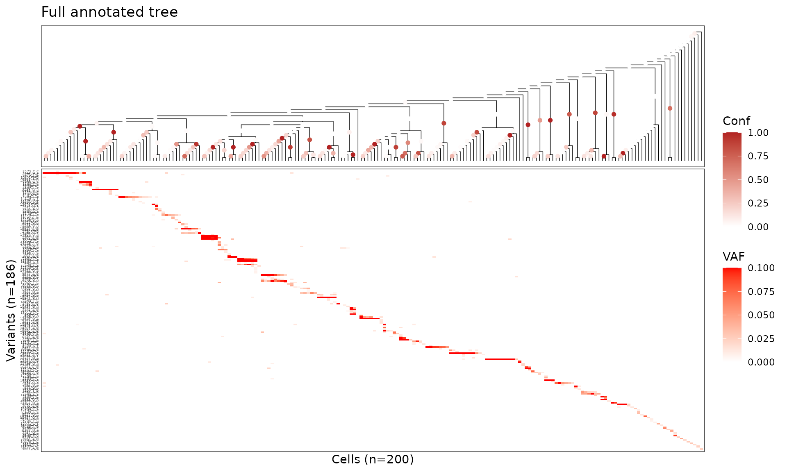
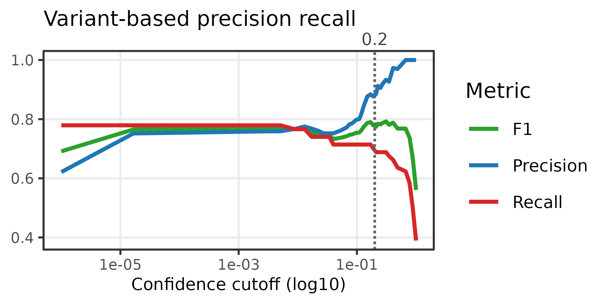
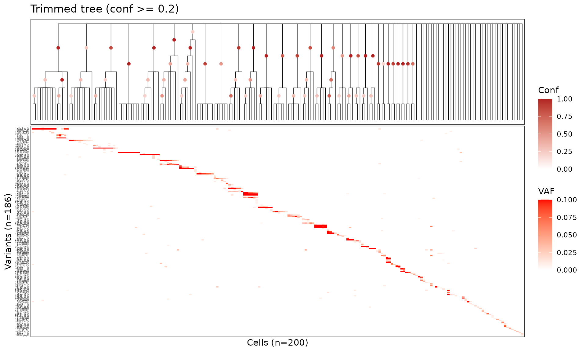
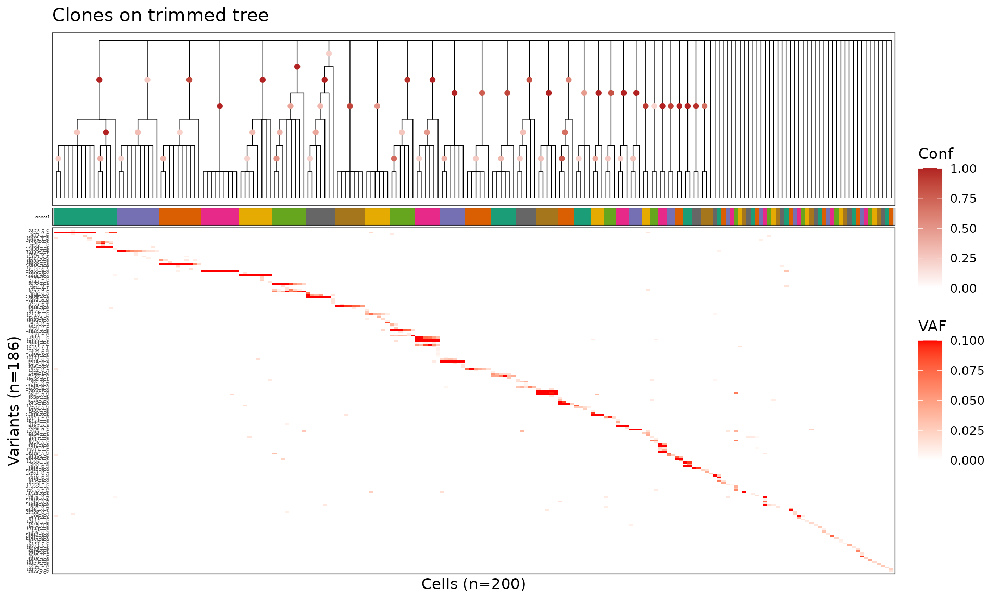
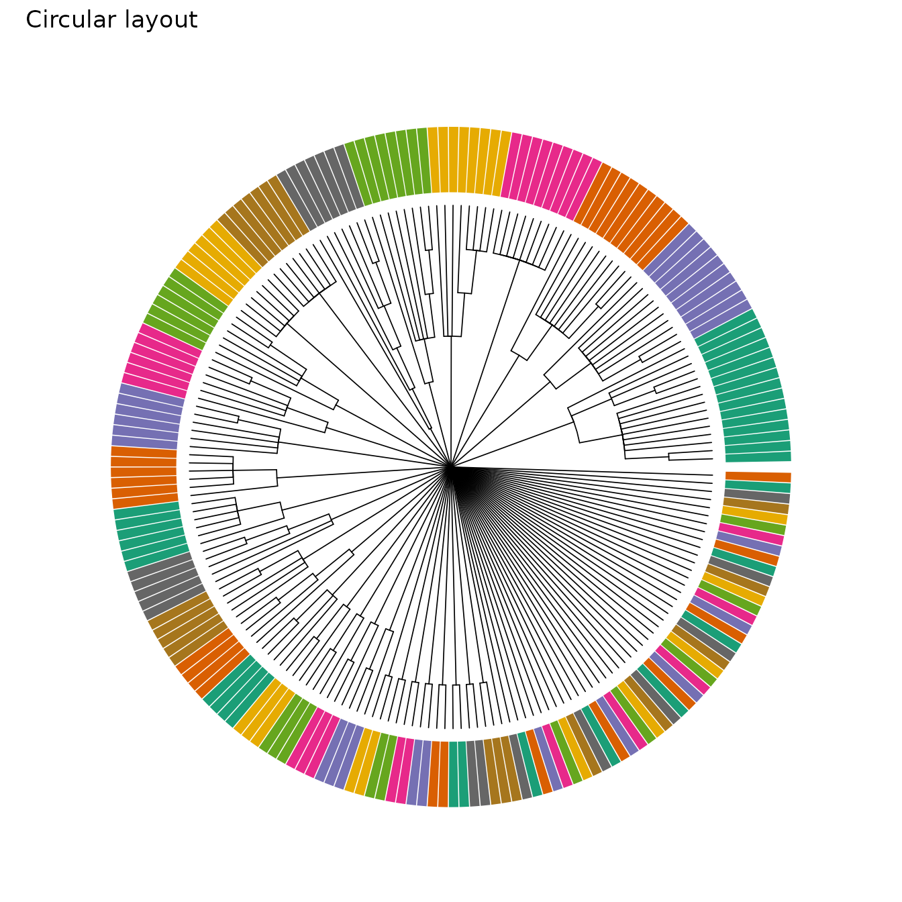

# Analysis workflow

This article walks through the standard post-inference analysis
workflow: **annotated tree → diagnostic PR curve → confidence trimming →
clone assignment → visualization**.

## Core concepts for interpretation

- **Initial tree topology**: a point-estimate starting tree constructed
  using neighbor joining (NJ) on continuous VAF matrices. This provides
  a fully-resolved (binary) initialization that empirically captures
  strong lineage signal before posterior sampling.
- **Posterior clade support**: per-node support values in
  `tree$node.label` (0–1) estimated from MCMC topology sampling.
- **Confidence-based topology refinement**: collapse internal edges
  below a support cutoff `τ` to obtain a refined lineage tree.

## Setup

``` r
library(mitodrift)
library(data.table)
library(ggplot2)
library(dplyr)
library(patchwork)
```

We use a small in vitro LARRY barcode sample (200 cells, 186 variants)
bundled with the package.

Run the same inference command used in the README:

``` bash
Rscript inst/bin/run_mitodrift_em.R \
  --mut_dat inst/extdata/pL1000_mut_dat.csv \
  --outdir mitodrift_demo \
  --tree_mcmc_iter 5000 \
  --tree_mcmc_chains 4 \
  --tree_mcmc_burnin 1000
```

This writes `mitodrift_demo/mitodrift_object.rds` and
`mitodrift_demo/tree_annotated.newick`. The workflow below uses the same
mutation table and an annotated tree generated with those settings.

``` r
mut_dat <- read.csv(
  system.file("extdata", "pL1000_mut_dat.csv", package = "mitodrift")
)
data(pL1000_tree_annot)
tree_annot <- pL1000_tree_annot
```

## Visualize the full binary tree

[`plot_phylo_heatmap2()`](https://teng-gao.github.io/mitodrift/reference/plot_phylo_heatmap2.md)
displays the tree alongside a variant heteroplasmy heatmap. Setting
`node_conf = TRUE` colours internal nodes by their confidence score.

``` r
plot_phylo_heatmap2(
  tree_annot,
  mut_dat,
  node_conf = TRUE,
  dot_size = 2,
  branch_length = FALSE,
  title = "Full annotated tree"
)
```



## Diagnostic: variant precision–recall curve

[`compute_variant_pr_curve()`](https://teng-gao.github.io/mitodrift/reference/compute_variant_pr_curve.md)
compares variant-defined cell partitions against tree clades across a
sweep of confidence cutoffs. This helps identify a threshold that
balances precision (are the clades real?) and recall (are we keeping
enough structure?).

``` r
pr_df <- compute_variant_pr_curve(tree_annot, mut_dat)
plot_prec_recall_vs_conf(
  pr_df,
  sample_name = "Variant-based precision recall",
  cutoff = 0.2
)
```



## Trim tree

Collapse low-confidence nodes below the chosen threshold with
[`trim_tree()`](https://teng-gao.github.io/mitodrift/reference/trim_tree.md).

``` r
tree_trim <- trim_tree(tree_annot, conf = 0.2)
```

Visualize the trimmed tree — polytomies replace poorly supported splits.

``` r
plot_phylo_heatmap2(
  tree_trim,
  mut_dat,
  node_conf = TRUE,
  dot_size = 2,
  branch_length = FALSE,
  title = "Trimmed tree (conf >= 0.2)"
)
```



## Clone assignment

[`assign_clones_polytomy()`](https://teng-gao.github.io/mitodrift/reference/assign_clones_polytomy.md)
partitions tips into clones based on the polytomy structure of the
trimmed tree.

``` r
clone_df <- assign_clones_polytomy(tree_trim)
head(clone_df)
```

    ## # A tibble: 6 × 6
    ##   cell               clade clade_node annot  size  frac
    ##   <chr>              <chr>      <int> <chr> <int> <dbl>
    ## 1 CAACTAATCATTGACA-1 1            202 1        15 0.075
    ## 2 GTTCATTTCGGTTTGG-1 1            202 1        15 0.075
    ## 3 ATGTAAGCAATTGCGC-1 1            202 1        15 0.075
    ## 4 GGGCAATAGGCCCAGT-1 1            202 1        15 0.075
    ## 5 CAGCCTAAGACAACAG-1 1            202 1        15 0.075
    ## 6 TAGGCTAGTCGAAGTC-1 1            202 1        15 0.075

## Visualize clones

Colour cells by clone assignment on both a rectangular heatmap view and
a circular layout.

``` r
clade_order <- unique(clone_df$clade)
clone_pal <- make_clade_pal(length(clade_order), labels = clade_order,
                            pal = "Dark2", cycle_len = 8, cycle_shift = 0)
```

``` r
plot_phylo_heatmap2(
  tree_trim,
  mut_dat,
  cell_annot = clone_df,
  annot_pal = clone_pal,
  node_conf = TRUE,
  dot_size = 2,
  branch_length = FALSE,
  title = "Clones on trimmed tree"
)
```



``` r
plot_phylo_circ(
  tree_trim,
  cell_annot = clone_df,
  annot_pal = clone_pal,
  annot_legend = FALSE,
  title = "Circular layout"
)
```


