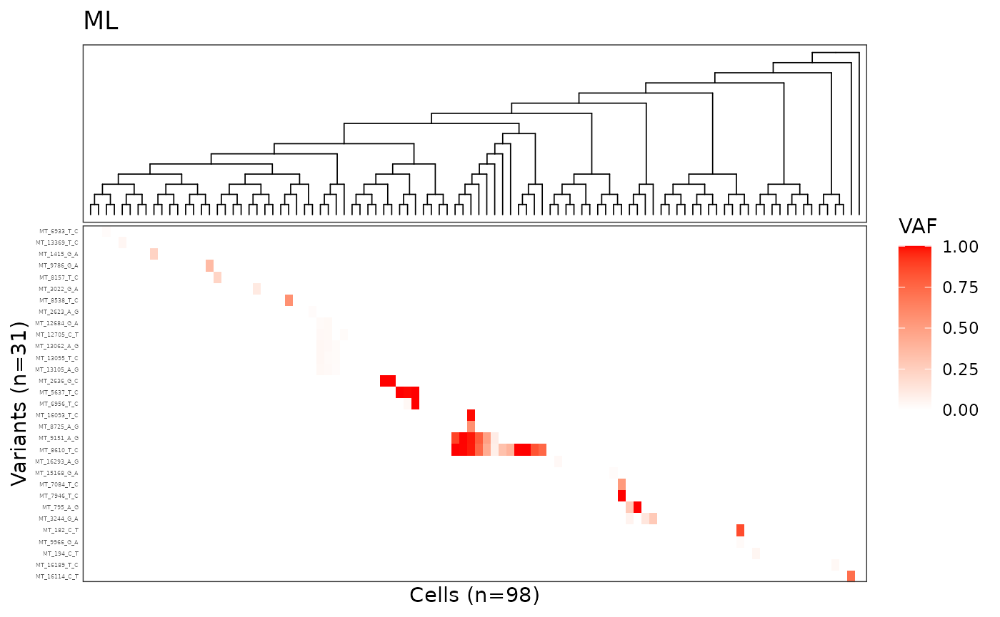
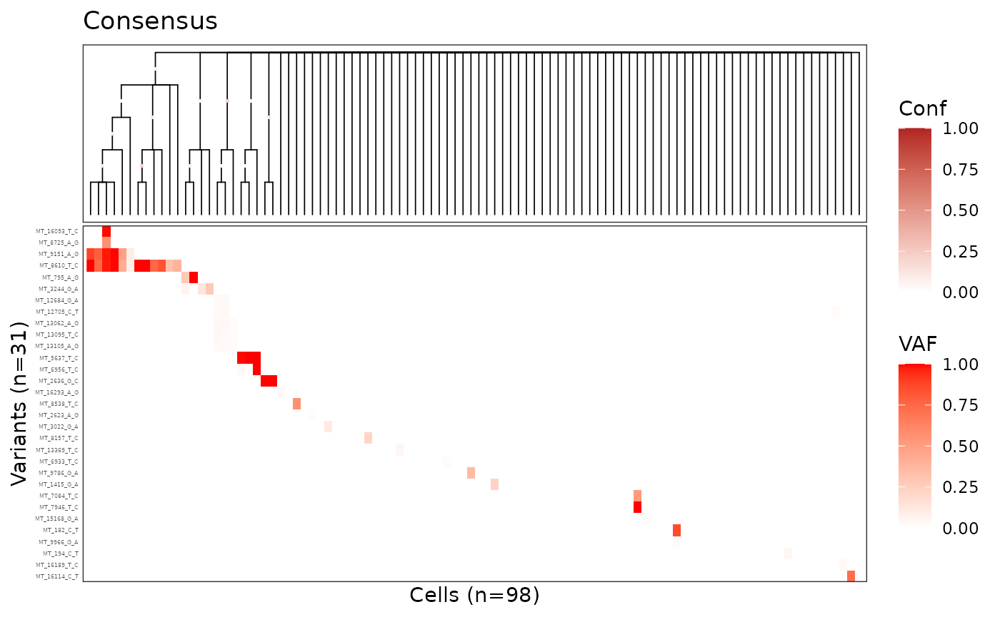

# MitoDrift tutorial

``` r
library(mitodrift)
library(ggtree)
library(ggplot2)
library(dplyr)
library(patchwork)
library(stringr)
```

## ML tree

``` r
tree_list = KX003_1_tree_list$tree_list
tree_ml = tree_list %>% .[[length(.)]]
plot_phylo_heatmap2(
    tree_ml, 
    KX003_1_mut_dat,
    dot_size = 0.1,
    branch_width = 0.3,
    branch_length = F,
    het_max = 1,
    title = 'ML'
)
```



## Consensus tree with clade confidence

``` r
# KX003_1_mcmc contains 3 chains of phylo trees - flatten and apply burnin
burnin = 100
mcmc_trees = lapply(KX003_1_mcmc, function(chain) chain[(burnin + 1):length(chain)]) %>%
    unlist(recursive = FALSE)
class(mcmc_trees) = "multiPhylo"

# Build consensus tree with clade frequencies using ape
tree_cons = ape::consensus(mcmc_trees, p = 0.5, rooted = TRUE)

# Use prop.part to compute clade frequencies
pp = ape::prop.part(mcmc_trees)
clade_freqs = attr(pp, "number") / length(mcmc_trees)
tree_cons$node.label = round(clade_freqs[1:tree_cons$Nnode], 2)

plot_phylo_heatmap2(
    tree_cons,
    KX003_1_mut_dat,
    dot_size = 1,
    branch_width = 0.3,
    branch_length = F,
    node_conf = T,
    het_max = 1,
    title = 'Consensus'
)
```


